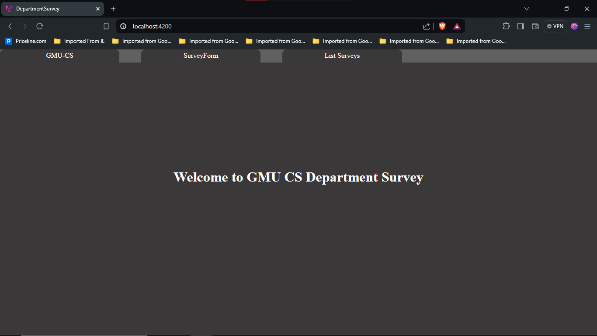
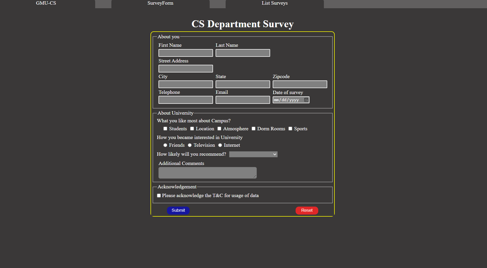
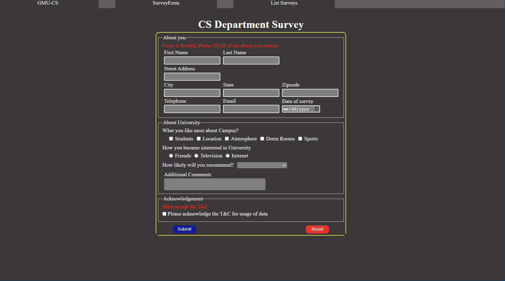
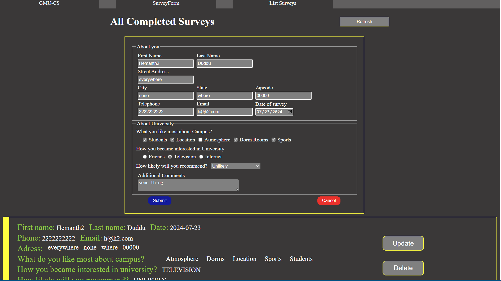

# Documentation:  Department Survey Website Using Angular and Spring Boot
## Project Team
Name: Venkata Sai Ayyappa Hemanth Duddu
GNumber: G01413649

Name: Venkata Satya Rohit Ramena
GNumber: G01379338
## File Structure
- departmentWebsite
    - frontend [contains angular project]
    - backend [contains spring boot project]
## High-level overiew
### Frontend:

#### Commands used to create angular project

- 1> command to install angular cli : npm install -g @angular/cli
  2> To create project in angular: ng new departmentSurvey
  3> Go inside the project folder using command: cd departmentSurvey
  4> To run the angular project use the command: npm start
  5> Student survey form using command: ng g c listSurveys 
  6> List of all survey using the command: ng g c surveyForm

- I have designed 2 extra components along with app component, namely `list-surveys` and `survey-form`.
- I have designed a service namely `survey-api` which has four methods `addSurvey` which handles the post request, `getSurveys` which returns a `httpClient` observable, `updateSurvey` which handles the update request and finally `deleteSurvey` which handles the delete operation.

### Backend:
- SpringBoot project with JPA, h2database, spring-web.
- It manages `SurveyFormEntity`, `SurveyFormRepository`, `SurveyFormServiceImpl` and finally `SurveyFormController`

## Below are complete details of implementation
### Frontend
- In the app component I have used `@if` directive with a underlying function for `(click)` event which changes to either to `survey-form` component or `list-surveys` component based on the click but defaults to welcome page as shown below

- By clicking on the `surveyForm` in the top, it updates the content to show the `survey-form` component which looks like below

- Where the user can fill the survey, user is required to fill all of the about you section but about university section is optional.
- Upon submission, form checks for basic validation of required fields, which outputs an collective error like below

- Once you fill the contents and click on submit, it will invoke the `onSubmit` function, this function takes the whole form as argument as `NgForm` and let's us manage the form's inputs.
- In the `onSubmit` method, we have used the `surveyFormApi` service and invoked `addSurvey` method which handles the post request and send the form data to backend and in turn saved to a database.
- Similary `reset` button has `(click)` event connected to `onReset` method which just resets the whole form.
- Another component is `list-surveys` clicking on this displays all the surveys stored on database. which looks like below:

- I created a `fetchData` method, which uses the service `surveyFormApi` injected into the `list-surveys` component using `inject()` function and makes use of the method provided by service called `getSurveys` which returns an observable.
- I created a `signal` called `allSurveysSignal` of type  `any` initialized to an `empty array`. which invokes subscription of the observable in `fetchData` method, I have set the data from server to this signal using `this.allSurveysSignal.set(fetchedData)`.
- Then I invoked this function in the `ngOnInit`, which make sures the data fetched upon component creation. 
- after having the data, I have made use of `@for` directive and populated the `list-surveys` page.
- I also created a `refresh` button, which invokes the method `refreshData()` through `(click)`, it just inturn calls the `fetchData` method and updates our signal.
- Then we have two buttons `delete` and `update`, `delete` has simple underlying `(click)` event which inturn use `surveyFormApi` service and just deletes that specific survey data and then refreshes the component.
- Where as when you click on `update` it will create space for similar form on top of page with the prefilled data. From there you can either `submit` to update data or `cancel` to discard the update. The page looks like below:

### Backend
- First I initilized the project using spring-starter with h2database, springJPA, spring-web as the dependencies.
- Then used the following settings in application.properties to initialize the h2 database connection.
```
    spring.datasource.url=jdbc:h2:file:./testdb
    spring.datasource.driverClassName=org.h2.Driver
    spring.datasource.username=sa
    spring.datasource.password=password
    spring.jpa.database-platform=org.hibernate.dialect.H2Dialect
    spring.h2.console.enabled=true
    spring.jpa.show-sql=true
    spring.jpa.hibernate.ddl-auto=update
```
- Then I created `SurveyFormEntity` using `@Entity` annotation with the following attributes
```
    @Id
    @GeneratedValue(strategy = GenerationType.IDENTITY)
    private Long id;

    private String firstName;
    private String lastName;
    private String address;
    private String city;
    private String state;
    private String zip;
    private String phone;
    private String email;
    private LocalDate dateOfSurvey;
    private boolean q1Students;
    private boolean q1Location;
    private boolean q1Campus;
    private boolean q1Atmosphere;
    private boolean q1Dorms;
    private boolean q1Sports;
    private String q2answer;
    private String q3answer;
    private String additionalComments;
```
- After setting entity pojo, created another file with `SurveyFormRepository` which is an interface that just extends to `JPARepository` for abstracted methods.
- Then Created another interface called `SurveyFormServices` which just puts out all the services available, in this case only two, which are 
```
    boolean postSurvey(surveyFormEntity surveyForm);
    HashMap<String,List<surveyFormEntity>> getSurveys();
    boolean deleteSurvey(Long surveyId);
    boolean updateSurvey(surveyFormEntity surveyForm);
```
- Then Created another class called `SurveyFormServiceImpl` which implements the `SurveyFormServices`, and also class should have annotation `@Service`. It also uses `SurveyFormRepository` for database operations which is initialized through `Dependency Injection` by spring-boot. Please see the code file `SurveyFormServiceImpl.java` for specific details.
- The last thing remaining is `Controller`, create a new class `SurveyFormController` and it is annotated by `@RestController`. It makes use of `SurveyFormServiceImpl` and implemented two controllers that can be used by the frontend, namely,
```

    @GetMapping(path = "/allSurveys")
    public ResponseEntity<HashMap<String,List<surveyFormEntity>>> allSurveys() {
        return new ResponseEntity<>(this.surveyFormServiceImpl.getSurveys(), HttpStatus.OK);
    }

    @PostMapping(path="/addSurvey")
    public ResponseEntity<surveyFormEntity> addSurvey(@RequestBody surveyFormEntity surveyFormEntity) {
        if(this.surveyFormServiceImpl.postSurvey(surveyFormEntity)){
            return new ResponseEntity<>(surveyFormEntity, HttpStatus.CREATED);
        }else{
            return new ResponseEntity<>(surveyFormEntity, HttpStatus.BAD_REQUEST);
        }
    }

    @PutMapping(path = "/updateSurvey")
    public ResponseEntity<surveyFormEntity> updateSurvey(@RequestBody surveyFormEntity surveyFormEntity) {
        if(this.surveyFormServiceImpl.updateSurvey(surveyFormEntity)){
            return new ResponseEntity<>(surveyFormEntity, HttpStatus.CREATED);
        }
        return new ResponseEntity<>(surveyFormEntity, HttpStatus.BAD_REQUEST);
    }

    @DeleteMapping(path = "/deleteSurvey/{id}")
    public ResponseEntity<Boolean> deleteSurvey(@PathVariable Long id) {
        if(this.surveyFormServiceImpl.deleteSurvey(id)){
            return new ResponseEntity<>(true, HttpStatus.OK);
        }
        return new ResponseEntity<>(false, HttpStatus.NOT_FOUND);
    }
```
- Finally one last file named as `CorsConfiguration` which uses an annotation `@Configuration`, which allows CORS for our angular server, it contents are as below:
```
@Bean
    public WebMvcConfigurer corsConfigurer() {
        return new WebMvcConfigurer() {
            @Override
            public void addCorsMappings(CorsRegistry registry) {
                registry.addMapping("/**").allowedOrigins("*").allowedMethods("GET", "POST", "PUT", "DELETE");
            }
        };
    }

```